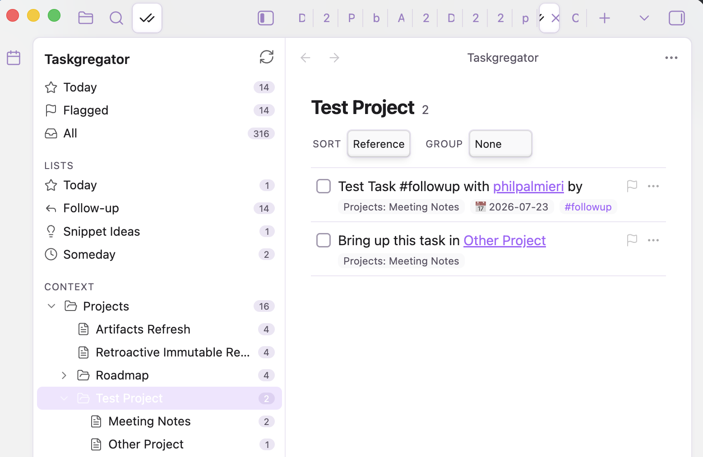
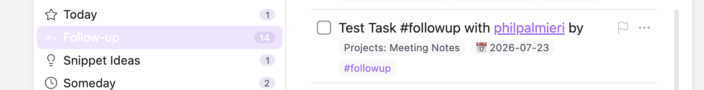
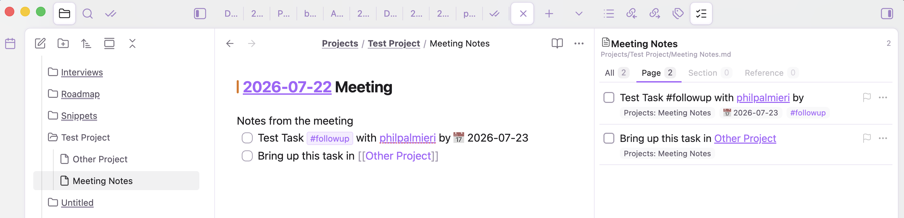
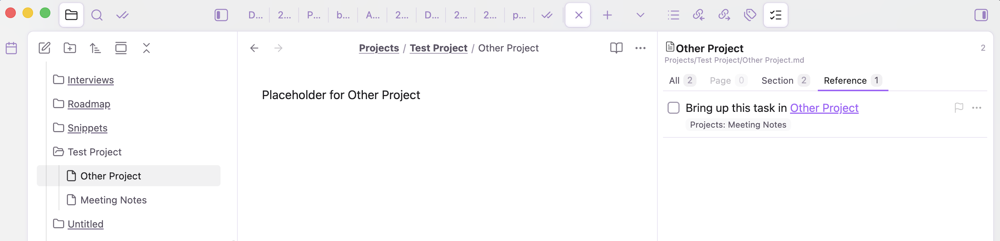
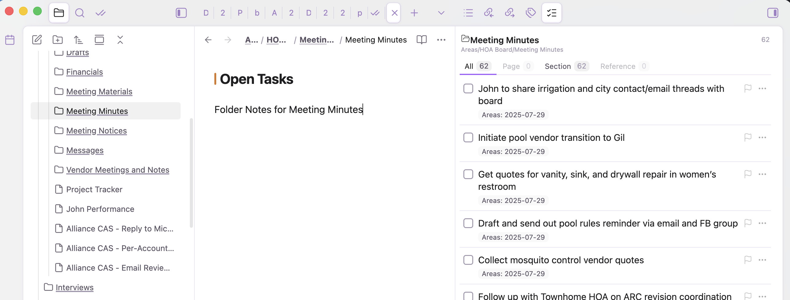
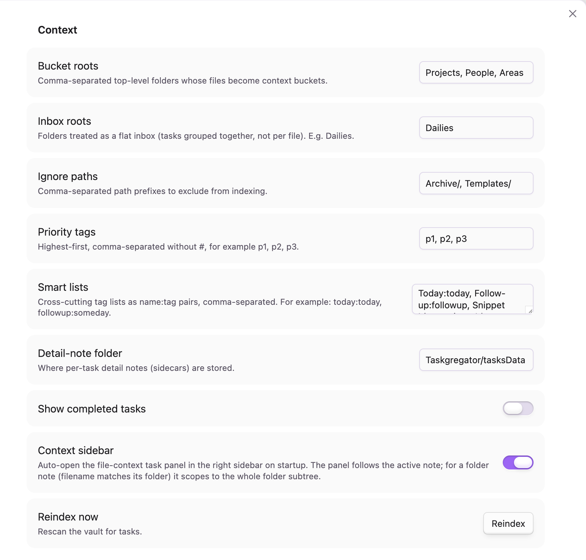

# Taskgregator

**Task management that works the way you already work.**

Taskgregator isn't another task system to adopt. It reads the plain markdown checkboxes you already write, wherever you already write them, and gives you fast, focused views of your work without asking you to change a thing.

No separate database. No special task files. No syntax to learn. No rules to follow. Your notes stay exactly as they are, and your tasks stay on the lines where you typed them. Taskgregator just aggregates, organizes, and surfaces them so you can see everything from different angles and act on it in place.

Think Things, Todoist, or TickTick, but pointed at the notes you already have instead of a silo you have to feed.



## Why it's different

Most task plugins make you pick a side: adopt a whole new system, or scatter each task into its own document with its own metadata block. Both make your notes serve the tool.

Taskgregator flips that. The tool serves your notes.

- **Zero adoption cost.** A task is just a markdown checkbox. If you can write `- [ ] thing`, you're already using it.
- **No enforced structure.** There's nothing you *have* to do. No required fields, no mandatory tags, no folder layout you must follow. Use as much or as little as you want.
- **No separate store.** Nothing is duplicated into a database or a task vault. The markdown line is the single source of truth, and every edit writes straight back to it.
- **Context comes from where things already live.** A task in `Projects/Website Redesign.md` belongs to that project. A task that mentions `[[People/Alex]]` belongs to Alex too. You don't tag it; the location and links already say it.
- **See it from any angle.** The same task shows up under its project, under the people it links to, and in your date-based smart lists, all at once, with no copies to keep in sync.



## The three surfaces

Everything reads from one shared index, so a selection you make in one place is reflected everywhere.

- **Navigator** (left sidebar): smart lists plus a roll-up tree of your context folders, docked right next to Files and Search. Pick one to drive the list.
- **Task list** (main area): the tasks for the current selection, with sort and grouping controls.
- **Context sidebar** (right sidebar): follows the note you're editing and shows its tasks, filtered by **Page / Section / Reference / All**.

### The task list

Group by project, sort by whatever you care about, and jump straight back to the source note from any card (shown above).

### The context sidebar

While you're writing a note, the right sidebar shows that note's tasks, so you never lose track of what a page owns.

**Page** shows the tasks written on the note in front of you.



**Reference** shows tasks living elsewhere that link *to* this note, so inbound work surfaces too.



**Section** rolls up a whole subtree. On a folder note (a file named after its folder), you get every open task beneath it in one list.



### Right-click anywhere

Because Taskgregator understands your task lines, you get a context menu on any task line in the normal editor, not just inside the plugin panel. Set priority, add a due date, toggle `#today`, open a detail note, or reveal the task in the task list.


## Features

- **Context tree** with roll-up counts. Configure which top-level folders become buckets (default: `Projects`, `People`, `Areas`). Files become sub-nodes; parent nodes aggregate everything beneath them.
- **Cross-indexing by wikilink.** A task that links `[[People/Alex]]` appears under Alex's node even though it was authored elsewhere.
- **Context sidebar** that follows the active note and scopes its tasks by Page, Section (folder subtree / folder note), or Reference.
- **Smart lists** driven by tags: Today, Follow-up, Snippet Ideas, Someday (all configurable). Plus built-in Today (by due date), Flagged (by priority), and All.
- **Inline editing** from the panel: toggle done/cancelled, cycle priority, set due/start dates, add tags, jump to source, all written back to the original markdown line.
- **Priority** using Tasks-plugin emoji signifiers (🔺 ⏫ 🔼) so it stays compatible with what you already use.
- **Per-task detail notes (sidecars).** Optionally attach a full markdown note to any task for extended context, links, and history. The task gets a lightweight block id (`^id`) only when you enrich it, and the sidecar backlinks to the source line. A 📝 chip on the card opens it.
- **Native right-click menu** on task lines across your whole vault.
- **Self-contained.** Reads and writes markdown directly. No dependency on Dataview or the Tasks plugin at runtime. Works on desktop and mobile.

## Task format

Taskgregator reads standard markdown checkboxes and Tasks-plugin emoji metadata. Nothing here is required; add only what's useful to you:

```markdown
- [ ] Open task
- [/] In progress
- [x] Done ✅ 2026-06-30
- [-] Cancelled ❌ 2026-06-30

- [ ] With metadata 📅 2026-07-01 🛫 2026-06-25 🔼 #followup
- [ ] Linked to a person [[People/Alex]] and a project [[Projects/Website Redesign]]
```

Recognized signifiers:

| Signifier | Meaning |
|-----------|---------|
| `📅 YYYY-MM-DD` | Due date |
| `🛫 YYYY-MM-DD` | Start date |
| `⏳ YYYY-MM-DD` | Scheduled |
| `➕ YYYY-MM-DD` | Created |
| `✅ YYYY-MM-DD` | Completed |
| `❌ YYYY-MM-DD` | Cancelled |
| `🔺 ⏫ 🔼 🔽 ⏬` | Priority (highest → lowest) |
| `#tag` | Smart-list membership |
| `[[link]]` | Cross-index target |
| `^blockid` | Stable identity (added lazily) |

## Usage

- The **navigator** opens in the left sidebar (its ✓✓ tab sits next to Files and Search). You can also run **Taskgregator: Open panel** from the command palette.
- Click a smart list or a tree node to load its tasks in the main list.
- On a task card: click the checkbox to complete, the flag to cycle priority, the `⋯` menu for dates/detail-note/cancel, a chip to jump to its source, or the 📝 chip to open its detail note.
- The **context sidebar** (right) tracks the note you're editing; use the Page / Section / Reference tabs to change scope.
- Right-click any task line in the editor for the same actions inline.

## Settings

- **Bucket roots**: folders that become top-level context buckets (default `Projects, People, Areas`).
- **Inbox roots**: folders treated as a flat inbox instead of per-file (default `Dailies`).
- **Ignore paths**: path prefixes to exclude from indexing.
- **Priority tags**: fallback priority tags (default `p1, p2, p3`).
- **Smart lists**: cross-cutting tag lists (`Name:tag` pairs).
- **Detail-note folder**: where sidecars are stored (default `Taskgregator/tasksData`).
- **Show completed tasks**: include done/cancelled tasks in the index.
- **Context sidebar**: enable the right-sidebar panel that follows the active note.



## What data it touches

Taskgregator only reads markdown files inside the folders you configure as bucket roots and inbox roots (by default `Projects`, `People`, `Areas`, and `Dailies`). It walks those folders directly rather than enumerating your whole vault, so files outside your configured roots are never opened. It does not make network requests, and it only writes back to the specific task lines and optional per-task detail notes you act on.

## License

[MIT](LICENSE) © Phil Palmieri
