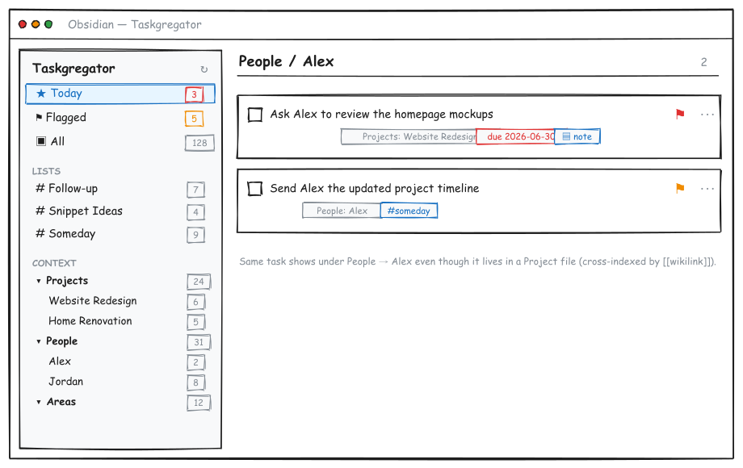
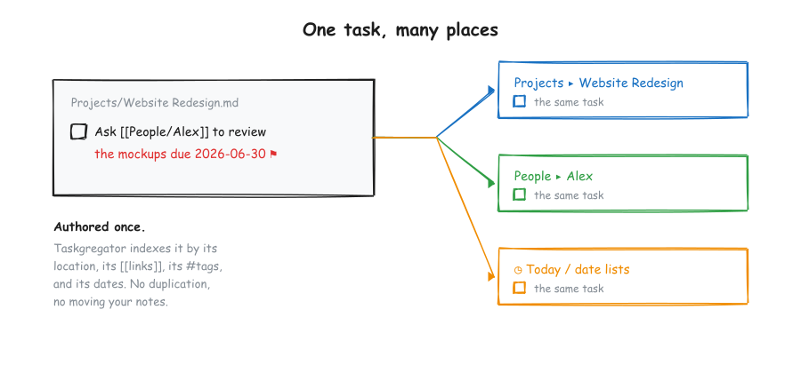
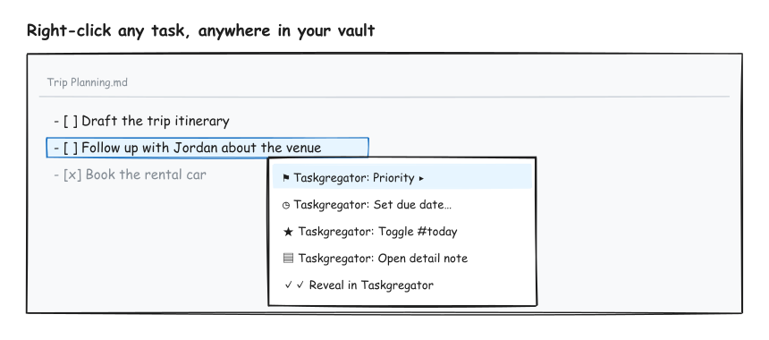

# Taskgregator

**A Things3-style aggregator for your native Obsidian tasks.**

Taskgregator sucks up every checkbox task across your vault and organizes it by context (Projects, People, Areas, whatever folders you choose), without moving your notes or locking tasks into their own files. Your tasks stay exactly where you wrote them, in the markdown they already live in. Taskgregator just gives you a fast, focused place to see, prioritize, schedule, and complete them.

Think of it as a task dashboard that reads and writes your real notes, not a separate task silo.

> Status: early (v0.1.0). Built for a single-user vault, works against plain markdown checkboxes and [Tasks-plugin](https://publish.obsidian.md/tasks/) style emoji metadata. No runtime dependency on Dataview or the Tasks plugin.

---

## Why

Most task plugins either make you adopt a whole new system or isolate each task in its own document. Taskgregator takes the opposite stance:

- Tasks are just markdown checkboxes in your notes. That's the source of truth.
- Where a task lives (and what it links to) *is* its context. A task in `Projects/Website Redesign.md` belongs to that project. A task that mentions `[[People/Alex]]` also belongs to Alex.
- You should be able to see everything in one place, act on it, and jump straight back to the note it came from.

## What it looks like

A two-pane view: a context sidebar on the left (smart lists + a roll-up tree of your folders), and a task list on the right.



*(Wireframes are intentionally low-fidelity. Names and projects shown are fictional.)*

## Core ideas

### One task, many places

A task is indexed by its location, its `[[wikilinks]]`, its `#tags`, and its dates, all at once. No duplication, no moving notes around.



So a task authored in a project note that references a person shows up under **both** that project **and** that person in the sidebar, and in your date-based smart lists if it has a due date.

### Right-click anywhere

Because Taskgregator understands your task lines, you get a context menu on any task line in the normal editor, not just inside the plugin panel. Set priority, add a due date, toggle `#today`, open a detail note, or reveal the task in the Taskgregator panel.



## Features

- **Context tree** with roll-up counts. Configure which top-level folders become buckets (default: `Projects`, `People`, `Areas`). Files become sub-nodes; parent nodes aggregate everything beneath them.
- **Cross-indexing by wikilink.** A task that links `[[People/Alex]]` appears under Alex's node even though it was authored elsewhere.
- **Smart lists** driven by tags: Today, Follow-up, Snippet Ideas, Someday (all configurable). Plus built-in Today (by due date), Flagged (by priority), and All.
- **Inline editing** from the panel: toggle done/cancelled, cycle priority, set due/start dates, add tags, jump to source, all written back to the original markdown line.
- **Priority** using Tasks-plugin emoji signifiers (🔺 ⏫ 🔼) so it stays compatible with what you already use.
- **Per-task detail notes (sidecars).** Optionally attach a full markdown note to any task for extended context, links, and history. The task gets a lightweight block id (`^id`) only when you enrich it, and the sidecar backlinks to the source line. A 📝 chip on the card opens it.
- **Native right-click menu** on task lines across your whole vault.
- **Self-contained.** Reads and writes markdown directly. No dependency on Dataview or the Tasks plugin at runtime.

## Task format

Taskgregator reads standard markdown checkboxes and Tasks-plugin emoji metadata:

```markdown
- [ ] Open task
- [/] In progress
- [x] Done ✅ 2026-06-30
- [-] Cancelled ❌ 2026-06-30

- [ ] With metadata 📅 2026-07-01 🛫 2026-06-25 🔼 #followup
- [ ] Linked to a person [[People/Alex]] and a project [[Projects/Website Redesign]]
```

Recognized signifiers:

| Signifier | Meaning |
|-----------|---------|
| `📅 YYYY-MM-DD` | Due date |
| `🛫 YYYY-MM-DD` | Start date |
| `⏳ YYYY-MM-DD` | Scheduled |
| `➕ YYYY-MM-DD` | Created |
| `✅ YYYY-MM-DD` | Completed |
| `❌ YYYY-MM-DD` | Cancelled |
| `🔺 ⏫ 🔼 🔽 ⏬` | Priority (highest → lowest) |
| `#tag` | Smart-list membership |
| `[[link]]` | Cross-index target |
| `^blockid` | Stable identity (added lazily) |

## Install

### Manual (recommended while in early development)

1. Download `main.js`, `manifest.json`, and `styles.css` from the [latest release](https://github.com/philpalmieri/obsidian-taskgregator/releases).
2. Copy them into your vault at `<vault>/.obsidian/plugins/taskgregator/`.
3. Reload Obsidian, then enable **Taskgregator** under Settings → Community plugins.

### From source

```bash
git clone https://github.com/philpalmieri/obsidian-taskgregator.git
cd obsidian-taskgregator
npm install
npm run build
```

Then copy `main.js`, `manifest.json`, and `styles.css` into `<vault>/.obsidian/plugins/taskgregator/`.

### Via BRAT

Add `philpalmieri/obsidian-taskgregator` as a beta plugin in [BRAT](https://github.com/TfTHacker/obsidian42-brat).

## Usage

- Open the panel from the ribbon (the ✓✓ icon) or run **Taskgregator: Open** from the command palette.
- Click a smart list or a tree node to filter the task list.
- On a task card: click the checkbox to complete, the flag to cycle priority, the `⋯` menu for dates/detail-note/cancel, a chip to jump to its source, or the 📝 chip to open its detail note.
- Right-click any task line in the editor for the same actions inline.

## Settings

- **Bucket roots** — folders that become top-level context buckets (default `Projects, People, Areas`).
- **Inbox roots** — folders treated as a flat inbox instead of per-file (default `Dailies`).
- **Ignore paths** — path prefixes to exclude from indexing.
- **Priority tags** — fallback priority tags (default `p1, p2, p3`).
- **Smart lists** — cross-cutting tag lists (`Name:tag` pairs).
- **Detail-note folder** — where sidecars are stored (default `Taskgregator/tasksData`).
- **Show completed tasks** — include done/cancelled tasks in the index.

## Roadmap

- Inline priority/action widgets rendered directly on tasks in live-preview and reading mode.
- "Convert task → Project" to promote a task (and its detail note) into a full project file.
- Nested sub-task hierarchies.
- Saved/custom views and filters.
- Drag to reorder / reschedule.

## Development

```bash
npm install
npm run dev     # watch build
npm run build   # type-check + production bundle
```

Source layout:

| File | Responsibility |
|------|----------------|
| `src/parser.ts` | Parse markdown lines into task objects; scan the vault. |
| `src/store.ts` | Index tasks, build the context tree, cross-index, smart lists. |
| `src/writer.ts` | Pure line transforms + write-back via `vault.process`. |
| `src/view.ts` | The panel UI (sidebar + task list). |
| `src/main.ts` | Plugin lifecycle, commands, editor context menu. |
| `src/settings.ts` | Settings model + settings tab. |

## License

[MIT](LICENSE) © Phil Palmieri
